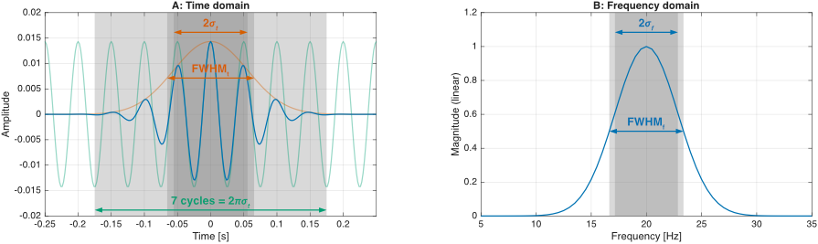
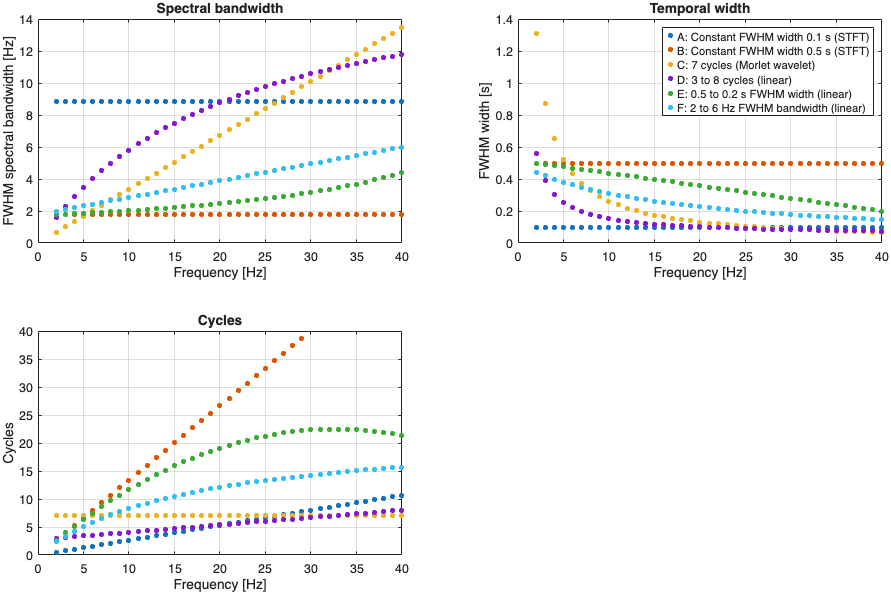
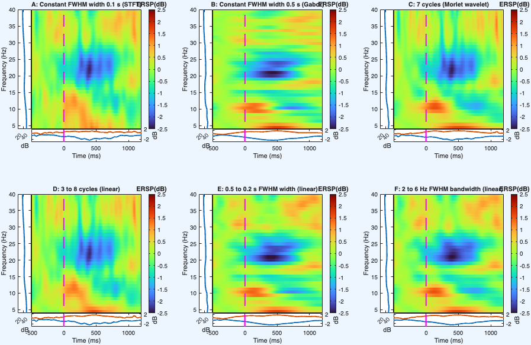
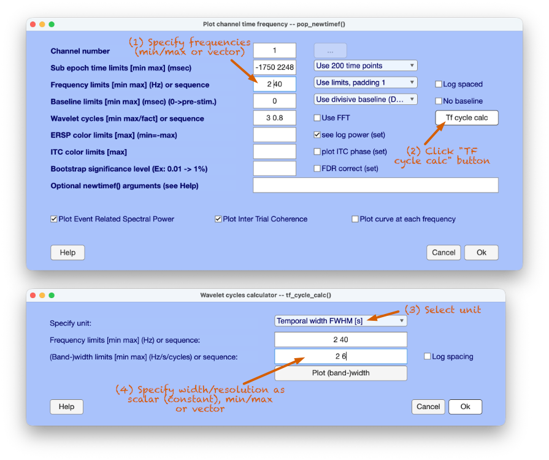

# tf_cycle_calc

A calculator to convert from different units of temporal and spectral resolution of Morlet wavelets to cycles for time-frequency analysis of M/EEG data.

------------------------------------------------------------------------

Morlet-type wavelets consist of a (co-)sine wave multiplied by a Gaussian envelope in the time domain and a corresponding Gaussian function in the frequency domain. The temporal and spectral resolutions of a specific wavelet are defined by the "width" of the Gaussian function, that is, the standard deviation $\sigma_{t}$ (typically in seconds) or $\sigma_{f}$ (typically in Hertz).

Many software packages for wavelet-based time-frequency analysis of M/EEG data use "cycles" as unit to define the temporal or spectral resolution of Morlet-type wavelets. Besides causing confusion with wavelet duration, "cycles" as unit is highly opaque and inaccessible. Cohen (2019) suggested to better define the resolution as the "full width at half maximum" (FWHM) of the Gaussian function (cf., Figure 1). He implemented this by adjusting the functions used for wavelet generation in the time or frequency domain. While valuable, this suggestion cannot (easily) be applied to existing software packages.

The TF cycles calculator computes the cycles parameter from different units of temporal or spectral resolution, including temporal and spectral FWHM, $\sigma_{t}$ and $\sigma_{f}$, 2 $\sigma_{t}$ and 2 $\sigma_{f}$ per wavelet center frequency. The calculator can also convert from cycles to any unit and report and visualize the wavelet resolution per center frequency. This is useful for appropriately reporting resolution in publications, for example. The calculator can be used on the MATLAB command line or as an EEGLAB GUI function, which can be called from the pop_newtimef EEGLAB GUI.



~**Figure 1.** Real (cosine) part of a Morlet wavelet with 20 Hz center frequency and 7 cycles width in the time and frequency domain.~

The FWHM unit is closely related to the -6 dB cutoff frequencies that are typically reported in spectral filtering for band-pass filters. Many manuscripts applying the Morlet wavelet transform traditionally reported 2 $\sigma_{t}$ and/or 2 $\sigma_{f}$ units (e.g., Tallon-Baudry et al., 1996).

An example application can be found in `demo_cohen2019.m` which results in Figures 2 and 3 below. This conceptually replicates Figure 5, Panels A and B from Cohen (2019) using the provided demo data. The TF transforms are displayed in Figure 2. The boxes indicate the temporal and spectral FWHM at low, intermediate and high frequencies (note that the area of all boxes is constant). The effects of parameter selection on different features of the TF decomposition are evident. Figure 3 visualizes the corresponding temporal and spectral wavelet resolutions and cycles per wavelet center frequency. `demo_cohen2019_eeglab.m` replicates Figure 2 using EEGLAB's pop_newtimef function (rather than the built-in simple TF transform intended for demonstration purposes). The output is displayed in Figure 4.






## CLI example

``` matlab
[cycles, widths_table] = tf_cycle_calc('freqs', 2:2:40, 'width', [0.5 0.2], 'width_unit', 'fwhm_t', 'log_spaced', 0, 'plot', 1)
```

Requested `'width'` is specified per frequency or as min/max (interpolated in linear or log spaced steps accordingly). If a scalar value is specified it is held constant for all frequenies, that is, STFT (Gabor transform) is computed in case of FWHM, 2 $\sigma$, or $\sigma$, and Morlet wavelet transform in case of cycles.

The `widths_table` output reports the wavelet resolution per frequency in the units cycles, spectral FWHM, temporal FWHM, 2 $\sigma_{f}$, 2 $\sigma_{t}$, $\sigma_{f}$, and $\sigma_{t}$.

## GUI example

## References

-   Cohen, M. X. (2019). A better way to define and describe Morlet wavelets for time-frequency analysis. *Neuroimage, 199*, 81-86. DOI: 10.1016/j.neuroimage.2019.05.048.

-   Tallon-Baudry, C., Bertrand, O., Delpuech, C., Pernier, J. (1996). Stimulus specificity of phase-locked and non-phase-locked 40 Hz visual responses in human. *J Neurosci, 16*(13), 4240-4249. DOI: 10.1523/JNEUROSCI.16-13-04240.1996.
